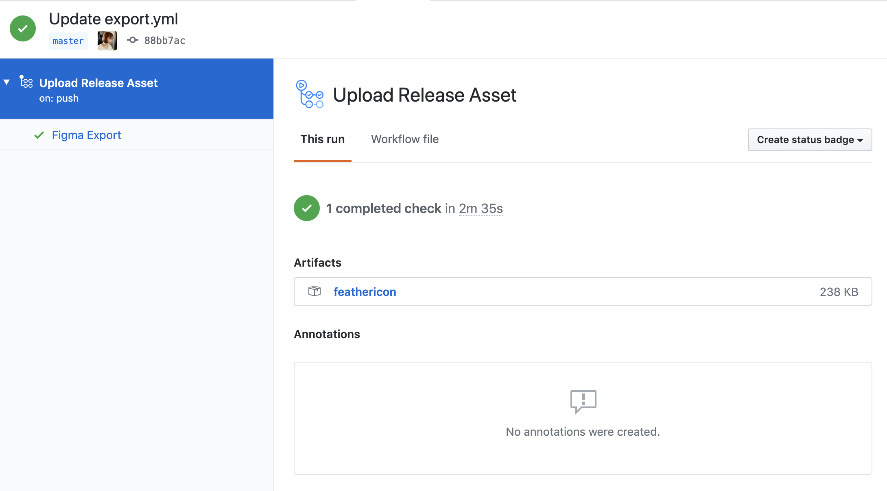

# figma-sample

## Download SVG
You can download feathericon SVG from each [Actions](https://github.com/feathericon/feathericon-figma/actions).

## Figma
https://www.figma.com/file/K7LUOW5a89CttKlexrd3PAP6/feathericon?node-id=0%3A1

