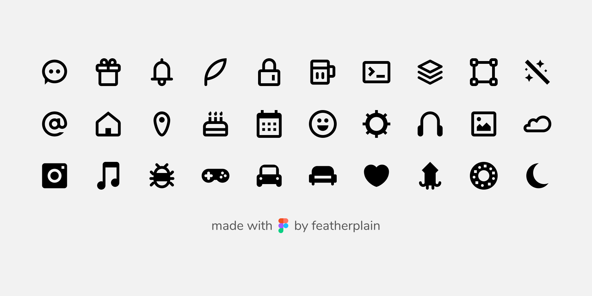

# feathericon Figma

## Download SVG

## Figma file URL
https://www.figma.com/file/K7LUOW5a89CttKlexrd3PAP6/feathericon?node-id=0%3A1

## LICENSE
- code license: MIT (C) [featherplain](https://github.com/featherplain)
- icon design license: [CC BY 4.0](https://creativecommons.org/licenses/by/4.0/deed.en)
